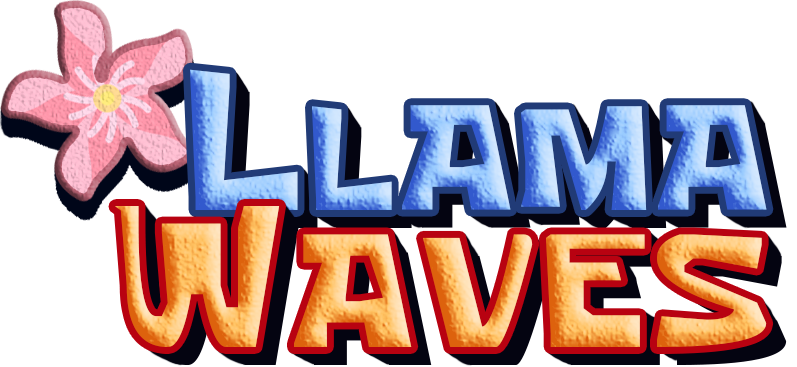
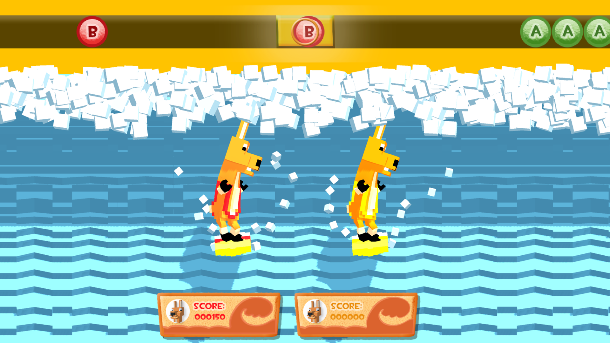
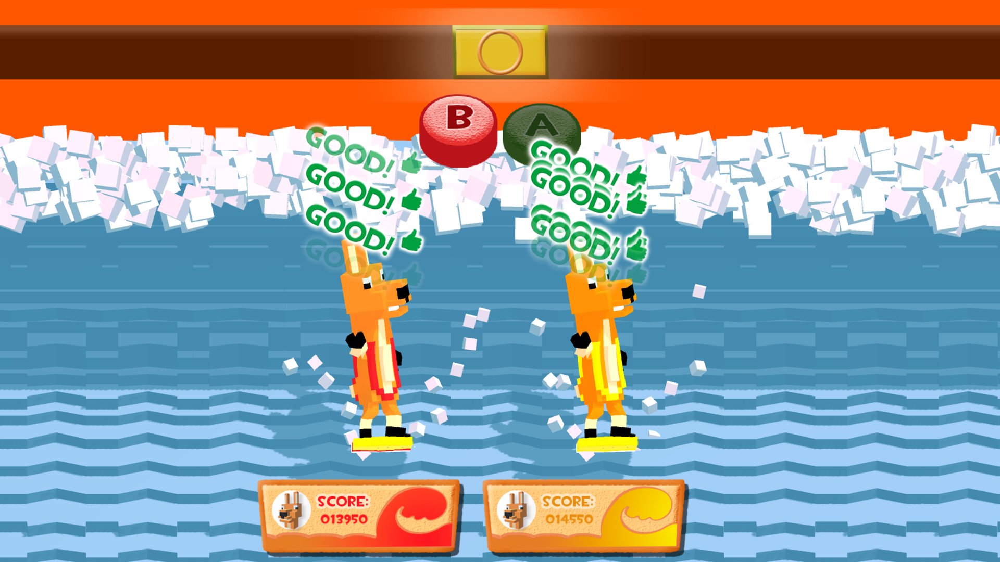

## 👾🌊Let´s surf with llamas🌊

Llama Waves is a party game developed by Neebula Games during the Global Game Jam '17. It's a musical game, in which the most precise and fastest player wins. It can be played with up to four players with an Xbox (or similar) controller.

## How to play 🎮
Download the executable from the Releases section of GitHub :octocat:. It is only compatible with Windows, because of some incompatibilities of Unity3D with controllers in other platforms.

The mechanic is simple, press A or B as the keys appear on the screen.

And when the **smash** time comes, smash the controller buttons to get the highest score. The fastest you tap, the more score you'll get.

Enjoy the game!

Made with ❤️ by Neebula Games.
